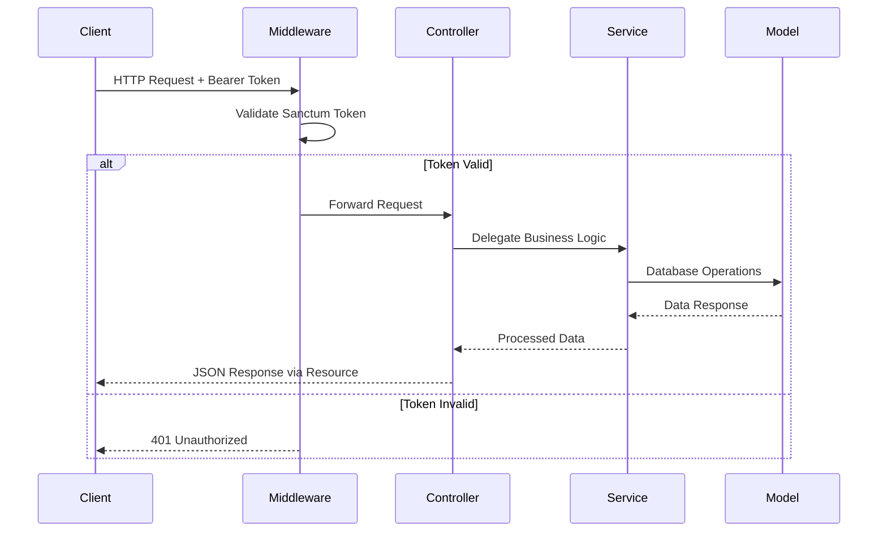

# Design Document: Customer Backend API

## Overview

Este documento describe el diseño técnico de la API backend para gestión de clientes en Laravel 10. La arquitectura sigue principios SOLID con separación clara de responsabilidades en capas: Controllers (presentación), Services (lógica de negocio), Form Requests (validación), y Resources (transformación de respuestas).

El sistema permite a clientes autenticados mediante Laravel Sanctum gestionar su perfil, contraseña, direcciones y consultar sus órdenes. Toda la comunicación se realiza mediante API REST con respuestas JSON estructuradas.

## Architecture

### Layered Architecture

```
┌─────────────────────────────────────────┐
│              HTTP Layer                 │
│  (Routes, Middleware, Authentication)   │
└─────────────────────────────────────────┘
                    │
┌─────────────────────────────────────────┐
│           Presentation Layer            │
│     (Controllers, Form Requests)        │
└─────────────────────────────────────────┘
                    │
┌─────────────────────────────────────────┐
│            Business Layer               │
│              (Services)                 │
└─────────────────────────────────────────┘
                    │
┌─────────────────────────────────────────┐
│             Data Layer                  │
│        (Models, Eloquent ORM)           │
└─────────────────────────────────────────┘
                    │
┌─────────────────────────────────────────┐
│           Response Layer                │
│             (Resources)                 │
└─────────────────────────────────────────┘
```

### Authentication Flow



## Components and Interfaces

### Controllers

#### UserController
```php
class UserController extends Controller
{
    public function __construct(private UserService $userService) {}
    
    public function show(): JsonResponse
    public function updatePassword(UpdatePasswordRequest $request): JsonResponse
}
```

#### CustomerOrderController
```php
class CustomerOrderController extends Controller
{
    public function __construct(private CustomerService $customerService) {}
    
    public function index(): JsonResponse
}
```

#### CustomerAddressController
```php
class CustomerAddressController extends Controller
{
    public function __construct(private CustomerAddressService $customerAddressService) {}
    
    public function index(): JsonResponse
    public function store(StoreAddressRequest $request): JsonResponse
    public function update(UpdateAddressRequest $request, string $uuid): JsonResponse
    public function destroy(string $uuid): JsonResponse
    public function setDefaultAddress(SetDefaultAddressRequest $request): JsonResponse
}
```

### Services

#### UserService
```php
class UserService
{
    public function updatePassword(User $user, string $currentPassword, string $newPassword): bool
    private function validateCurrentPassword(User $user, string $password): bool
}
```

#### CustomerService
```php
class CustomerService
{
    public function getOrders(Customer $customer): Collection
}
```

#### CustomerAddressService
```php
class CustomerAddressService
{
    public function getAddresses(Customer $customer): Collection
    public function createAddress(Customer $customer, array $data): Address
    public function updateAddress(Address $address, array $data): Address
    public function deleteAddress(Address $address): bool
    public function setDefaultAddress(Customer $customer, Address $address, string $type): bool
    private function clearDefaultAddress(Customer $customer, string $type): void
    private function validateAddressOwnership(Address $address, Customer $customer): bool
}
```

### Form Requests

#### UpdatePasswordRequest
```php
class UpdatePasswordRequest extends FormRequest
{
    public function rules(): array
    {
        return [
            'current_password' => 'required|string',
            'password' => 'required|string|min:8|confirmed',
        ];
    }
}
```

#### StoreAddressRequest
```php
class StoreAddressRequest extends FormRequest
{
    public function rules(): array
    {
        return [
            'first_name' => 'required|string|max:255',
            'last_name' => 'required|string|max:255',
            'company' => 'nullable|string|max:255',
            'phone' => 'nullable|string|max:20',
            'address_line1' => 'required|string|max:255',
            'address_line2' => 'nullable|string|max:255',
            'city' => 'required|string|max:255',
            'state' => 'required|string|max:255',
            'postal_code' => 'required|string|max:20',
            'country' => 'required|string|max:2',
            'type' => 'required|in:shipping,billing',
        ];
    }
}
```

#### UpdateAddressRequest
```php
class UpdateAddressRequest extends FormRequest
{
    public function rules(): array
    {
        return [
            'first_name' => 'sometimes|string|max:255',
            'last_name' => 'sometimes|string|max:255',
            'company' => 'nullable|string|max:255',
            'phone' => 'nullable|string|max:20',
            'address_line1' => 'sometimes|string|max:255',
            'address_line2' => 'nullable|string|max:255',
            'city' => 'sometimes|string|max:255',
            'state' => 'sometimes|string|max:255',
            'postal_code' => 'sometimes|string|max:20',
            'country' => 'sometimes|string|max:2',
            'type' => 'sometimes|in:shipping,billing',
        ];
    }
}
```

#### SetDefaultAddressRequest
```php
class SetDefaultAddressRequest extends FormRequest
{
    public function rules(): array
    {
        return [
            'address_id' => 'required|uuid|exists:addresses,uuid',
            'type' => 'required|in:shipping,billing',
        ];
    }
}
```

### Resources

#### UserResource
```php
class UserResource extends JsonResource
{
    public function toArray($request): array
    {
        return [
            'id' => $this->id,
            'name' => $this->name,
            'email' => $this->email,
            'customer' => new CustomerResource($this->whenLoaded('customer')),
        ];
    }
}
```

#### CustomerResource
```php
class CustomerResource extends JsonResource
{
    public function toArray($request): array
    {
        return [
            'id' => $this->id,
            'uuid' => $this->uuid,
            'first_name' => $this->first_name,
            'last_name' => $this->last_name,
            'phone' => $this->phone,
            'date_of_birth' => $this->date_of_birth,
        ];
    }
}
```

#### OrderResource
```php
class OrderResource extends JsonResource
{
    public function toArray($request): array
    {
        return [
            'id' => $this->id,
            'uuid' => $this->uuid,
            'order_number' => $this->order_number,
            'status' => $this->status,
            'total' => $this->total,
            'subtotal' => $this->subtotal,
            'tax_amount' => $this->tax_amount,
            'shipping_amount' => $this->shipping_amount,
            'created_at' => $this->created_at,
            'updated_at' => $this->updated_at,
            'items' => OrderItemResource::collection($this->whenLoaded('orderItems')),
            'shipping_address' => new AddressResource($this->whenLoaded('shippingAddress')),
            'billing_address' => new AddressResource($this->whenLoaded('billingAddress')),
        ];
    }
}
```

#### OrderItemResource
```php
class OrderItemResource extends JsonResource
{
    public function toArray($request): array
    {
        return [
            'id' => $this->id,
            'product_name' => $this->product_name,
            'product_sku' => $this->product_sku,
            'quantity' => $this->quantity,
            'price' => $this->price,
            'subtotal' => $this->subtotal,
        ];
    }
}
```

#### AddressResource
```php
class AddressResource extends JsonResource
{
    public function toArray($request): array
    {
        return [
            'id' => $this->id,
            'uuid' => $this->uuid,
            'first_name' => $this->first_name,
            'last_name' => $this->last_name,
            'company' => $this->company,
            'phone' => $this->phone,
            'address_line1' => $this->address_line1,
            'address_line2' => $this->address_line2,
            'city' => $this->city,
            'state' => $this->state,
            'postal_code' => $this->postal_code,
            'country' => $this->country,
            'type' => $this->type,
            'is_default' => $this->is_default,
        ];
    }
}
```

## Data Models

### Existing Database Schema

```sql
-- users table (existing)
users: id, name, email, email_verified_at, password, remember_token, created_at, updated_at

-- customers table (existing)
customers: id, uuid, user_id, first_name, last_name, phone, date_of_birth, 
          default_shipping_address_id, default_billing_address_id, created_at, updated_at

-- addresses table (existing)
addresses: id, uuid, customer_id, first_name, last_name, company, phone, 
          address_line1, address_line2, city, state, postal_code, country, 
          type, deleted_at, created_at, updated_at
```

### Model Relationships

```php
// User Model
class User extends Authenticatable
{
    public function customer(): HasOne
    {
        return $this->hasOne(Customer::class);
    }
}

// Customer Model
class Customer extends Model
{
    public function user(): BelongsTo
    {
        return $this->belongsTo(User::class);
    }
    
    public function addresses(): HasMany
    {
        return $this->hasMany(Address::class);
    }
    
    public function orders(): HasMany
    {
        return $this->hasMany(Order::class);
    }
    
    public function defaultShippingAddress(): BelongsTo
    {
        return $this->belongsTo(Address::class, 'default_shipping_address_id');
    }
    
    public function defaultBillingAddress(): BelongsTo
    {
        return $this->belongsTo(Address::class, 'default_billing_address_id');
    }
}

// Address Model
class Address extends Model
{
    use SoftDeletes;
    
    public function customer(): BelongsTo
    {
        return $this->belongsTo(Customer::class);
    }
}
```

## Correctness Properties

*Una propiedad es una característica o comportamiento que debe mantenerse verdadero en todas las ejecuciones válidas de un sistema - esencialmente, una declaración formal sobre lo que el sistema debe hacer. Las propiedades sirven como puente entre especificaciones legibles por humanos y garantías de corrección verificables por máquina.*

Después de revisar todas las propiedades identificadas como testeables en el prework, he identificado varias redundancias que pueden consolidarse:

**Reflexión de Propiedades:**
- Las propiedades de códigos de respuesta HTTP (401, 403, 404, 422, 500) pueden consolidarse en una propiedad general de manejo de errores
- Las propiedades de validación de FormRequests pueden agruparse por tipo de request
- Las propiedades de formateo de Resources pueden consolidarse por tipo de resource
- Las propiedades de ownership verification se repiten y pueden consolidarse

### Property 1: Authentication and Authorization
*Para cualquier* endpoint protegido, cuando no hay token válido debe retornar HTTP 401, cuando hay token válido debe permitir acceso, y cuando se accede a recursos no propios debe retornar HTTP 403
**Validates: Requirements 1.2, 1.3, 7.3, 8.2, 9.4**

### Property 2: User Resource Formatting
*Para cualquier* usuario, el UserResource debe incluir id, name, email y datos del customer cuando esté disponible
**Validates: Requirements 2.2**

### Property 3: Password Update Validation and Processing
*Para cualquier* request de cambio de contraseña, debe validar current_password (requerido), password (mínimo 8 caracteres, confirmado), verificar contraseña actual, y actualizar si es válida retornando HTTP 200, o retornar HTTP 422 si es inválida
**Validates: Requirements 3.1, 3.2, 3.3, 3.4, 3.5, 3.6**

### Property 4: Customer Orders Retrieval and Formatting
*Para cualquier* cliente autenticado, debe retornar solo sus órdenes con OrderResource que incluya id, order_number, status, total, created_at, items, shipping_address y billing_address
**Validates: Requirements 4.1, 4.2**

### Property 5: Order Items and Address Resource Formatting
*Para cualquier* item de orden, el OrderItemResource debe incluir product_name, quantity, price y subtotal, y para cualquier dirección, el AddressResource debe formatear correctamente todos los campos
**Validates: Requirements 4.3, 4.4**

### Property 6: Customer Addresses Retrieval and Formatting
*Para cualquier* cliente autenticado, debe retornar solo sus direcciones no soft-deleted con AddressResource que incluya uuid, first_name, last_name, company, phone, address_line1, address_line2, city, state, postal_code, country, type, is_default
**Validates: Requirements 5.1, 5.2**

### Property 7: Address Creation Validation and Processing
*Para cualquier* request de creación de dirección, debe validar campos requeridos (first_name, last_name, address_line1, city, state, postal_code, country), validar type como enum válido, validar phone como opcional pero con formato válido, crear dirección asociada al customer correcto, y retornar HTTP 201 con dirección formateada
**Validates: Requirements 6.1, 6.2, 6.3, 6.4, 6.5, 6.6**

### Property 8: Address Update with Ownership Verification
*Para cualquier* request de actualización de dirección, debe verificar ownership, validar campos proporcionados, retornar HTTP 404 si no existe, retornar HTTP 403 si no es propia, actualizar si es válida y retornar HTTP 200 con dirección formateada
**Validates: Requirements 7.1, 7.2, 7.3, 7.4, 7.5, 7.6**

### Property 9: Address Deletion with Default Address Cleanup
*Para cualquier* request de eliminación de dirección, debe verificar ownership, retornar HTTP 404 si no existe, retornar HTTP 403 si no es propia, limpiar referencias de dirección por defecto si aplica, realizar soft delete, y retornar HTTP 204
**Validates: Requirements 8.1, 8.2, 8.3, 8.4, 8.5, 8.6**

### Property 10: Default Address Configuration
*Para cualquier* request de configuración de dirección por defecto, debe validar address_id y type, verificar ownership, retornar HTTP 404 si no existe, retornar HTTP 403 si no es propia, actualizar el campo correcto del customer según type (shipping/billing), y retornar HTTP 200
**Validates: Requirements 9.1, 9.2, 9.3, 9.4, 9.5, 9.6, 9.7, 9.8**

### Property 11: Consistent Error Response Formatting
*Para cualquier* error en la API, debe retornar el código HTTP apropiado (422 para validación, 401 para autenticación, 403 para autorización, 404 para recurso no encontrado, 500 para errores internos) con estructura de respuesta consistente
**Validates: Requirements 10.1, 10.2, 10.3, 10.4, 10.5**

## Error Handling

### Error Response Structure

Todas las respuestas de error siguen la estructura estándar de Laravel:

```json
{
    "message": "Descripción del error",
    "errors": {
        "field_name": ["Error específico del campo"]
    }
}
```

### HTTP Status Codes

- **200**: Operación exitosa
- **201**: Recurso creado exitosamente
- **204**: Operación exitosa sin contenido
- **401**: No autenticado (token inválido o ausente)
- **403**: No autorizado (acceso a recurso no propio)
- **404**: Recurso no encontrado
- **422**: Error de validación
- **500**: Error interno del servidor

### Exception Handling

```php
// En Controllers
try {
    $result = $this->service->performOperation($data);
    return response()->json($result, 200);
} catch (ValidationException $e) {
    return response()->json([
        'message' => 'Validation failed',
        'errors' => $e->errors()
    ], 422);
} catch (ModelNotFoundException $e) {
    return response()->json([
        'message' => 'Resource not found'
    ], 404);
} catch (UnauthorizedException $e) {
    return response()->json([
        'message' => 'Unauthorized access'
    ], 403);
}
```

## Testing Strategy

### Dual Testing Approach

El sistema implementará tanto **unit tests** como **property-based tests** para garantizar cobertura completa:

**Unit Tests:**
- Casos específicos y ejemplos concretos
- Casos edge (usuario sin customer, cliente sin órdenes, cliente sin direcciones)
- Condiciones de error específicas
- Integración entre componentes

**Property-Based Tests:**
- Propiedades universales que deben cumplirse para todos los inputs
- Validación exhaustiva mediante generación de datos aleatorios
- Verificación de invariantes del sistema
- Mínimo 100 iteraciones por test

### Property-Based Testing Configuration

**Framework:** Utilizaremos **Pest** con **QuickCheck for PHP** para property-based testing

**Configuración de Tests:**
- Cada property test ejecutará mínimo 100 iteraciones
- Cada test referenciará su propiedad del documento de design
- Formato de tag: **Feature: customer-backend-api, Property {number}: {property_text}**

**Ejemplo de Property Test:**
```php
it('validates authentication and authorization for protected endpoints', function () {
    // Feature: customer-backend-api, Property 1: Authentication and Authorization
    
    forAll(
        Generator::elements(['/api/user', '/api/customer/orders', '/api/customer/addresses']),
        Generator::oneOf(Generator::constant(null), Generator::string())
    )->then(function ($endpoint, $token) {
        if ($token === null) {
            // Should return 401 for no token
            $response = $this->getJson($endpoint);
            expect($response->status())->toBe(401);
        } else {
            // Should allow access with valid token or return 401 with invalid token
            $response = $this->getJson($endpoint, ['Authorization' => "Bearer $token"]);
            expect($response->status())->toBeIn([200, 401]);
        }
    });
})->repeat(100);
```

### Unit Testing Balance

**Unit Tests se enfocan en:**
- Ejemplos específicos de cada endpoint
- Casos edge identificados en el prework
- Integración entre Controllers y Services
- Validación de FormRequests con datos específicos

**Property Tests se enfocan en:**
- Validación de propiedades universales
- Generación masiva de inputs para encontrar casos edge no considerados
- Verificación de invariantes del sistema
- Cobertura exhaustiva de combinaciones de datos

### Test Organization

```
tests/
├── Feature/
│   ├── UserControllerTest.php (unit tests)
│   ├── CustomerOrderControllerTest.php (unit tests)
│   ├── CustomerAddressControllerTest.php (unit tests)
│   └── Properties/
│       ├── AuthenticationPropertiesTest.php
│       ├── ValidationPropertiesTest.php
│       ├── ResourceFormattingPropertiesTest.php
│       └── BusinessLogicPropertiesTest.php
├── Unit/
│   ├── Services/
│   │   ├── UserServiceTest.php
│   │   ├── CustomerServiceTest.php
│   │   └── CustomerAddressServiceTest.php
│   └── Requests/
│       ├── UpdatePasswordRequestTest.php
│       ├── StoreAddressRequestTest.php
│       ├── UpdateAddressRequestTest.php
│       └── SetDefaultAddressRequestTest.php
```

Cada property test debe implementar exactamente una propiedad del documento de design y estar etiquetado con el formato especificado para trazabilidad completa.